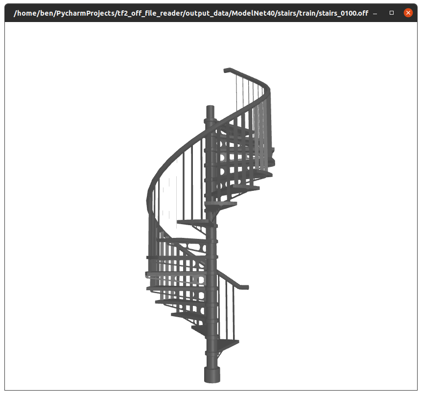
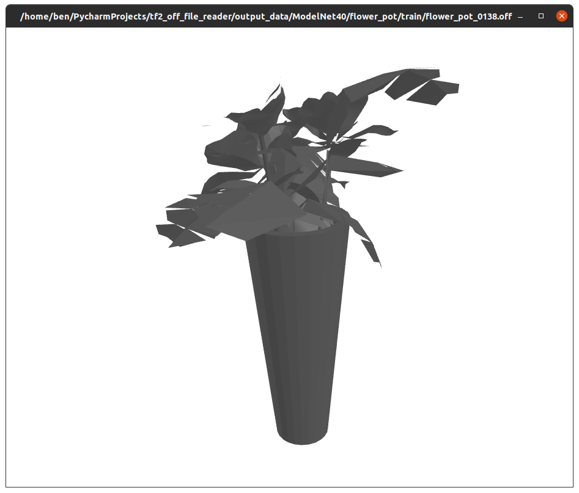
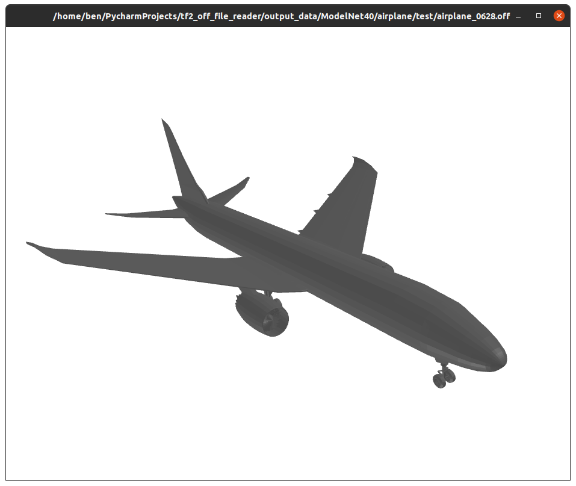

# '.OFF' files reader using Tensorflow 2.3
OFF (Object File Format) 
Read '.OFF' files using Tensorflow. It can be used to parse the Princeton's ModelNet data as part of a tf.data.Dataset pipeline.
Not necessarily the most optimized way but a really good starting point.

When fiddling with the ModelNet40 dataset I found myself in need to read 'OFF' files 
but keeping it inside Tensorflow2 Dataset pipeline, so I implemented a reader for that type of file.

## Screenshots
From the 'ModelNet40' by Princeton

## Requirements
Python3.7, Tensorflow2.3, trimesh, scipy, networkx, pyglet

# Composition of OFF file
https://en.wikipedia.org/wiki/OFF_(file_format)
 To save you some time, taken from Wikipedia:

The composition of a standard OFF file is as follows:[4]

First line (optional): the letters OFF to mark the file type. 
Second line: the number of vertices, number of faces, and number of edges, in order (the latter can be ignored). 
List of vertices: X, Y and Z coordinates. 
List of faces: number of vertices, followed by the indexes of the composing vertices, in order (indexed from zero).
Optionally, the RGB values for the face color can follow the elements of the faces.
The four-dimensional OFF format, most notably used by Stella4D, which allows visualization of four-dimensional objects, has a few minor differences:[5]

First line (optional): the letters 4OFF to mark the file type. 
Second line: the number of vertices, number of faces, number of edges, and number of cells, in order (the number of edges can be ignored). 
List of vertices: X, Y, Z and W coordinates. 
List of faces: number of vertices, followed by the indexes of the composing vertices, in order (indexed from zero). 
List of cells: number of faces, followed by the indexes of the composing faces, in order (indexed from zero). 
Optionally, the RGB values for the cell color can follow the elements of the cells. 
Comments are marked with a pound sign (#): these are not read by the software. 
Example 
>     OFF
>      1.0  0.0 1.4142
>      0.0  1.0 1.4142
>     -1.0  0.0 1.4142
>      0.0 -1.0 1.4142
>      1.0  0.0 0.0
>      0.0  1.0 0.0
>     -1.0  0.0 0.0
>      0.0 -1.0 0.0
>     4  0 1 2 3  255 0 0 #red
>     4  7 4 0 3  0 255 0 #green
>     4  4 5 1 0  0 0 255 #blue
>     4  5 6 2 1  0 255 0 
>     4  3 2 6 7  0 0 255
>     4  6 5 4 7  255 0 0